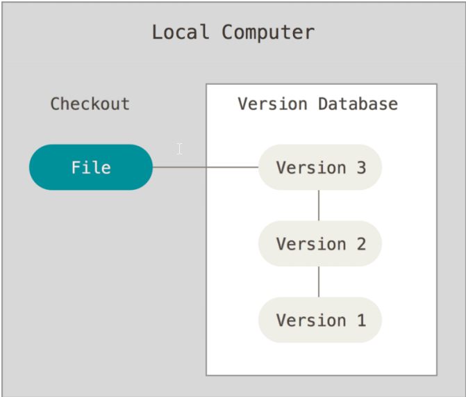
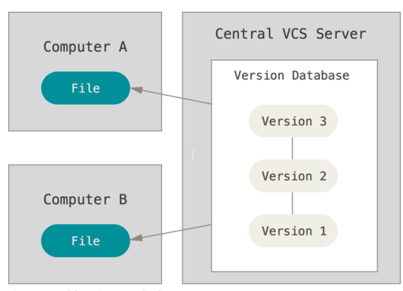
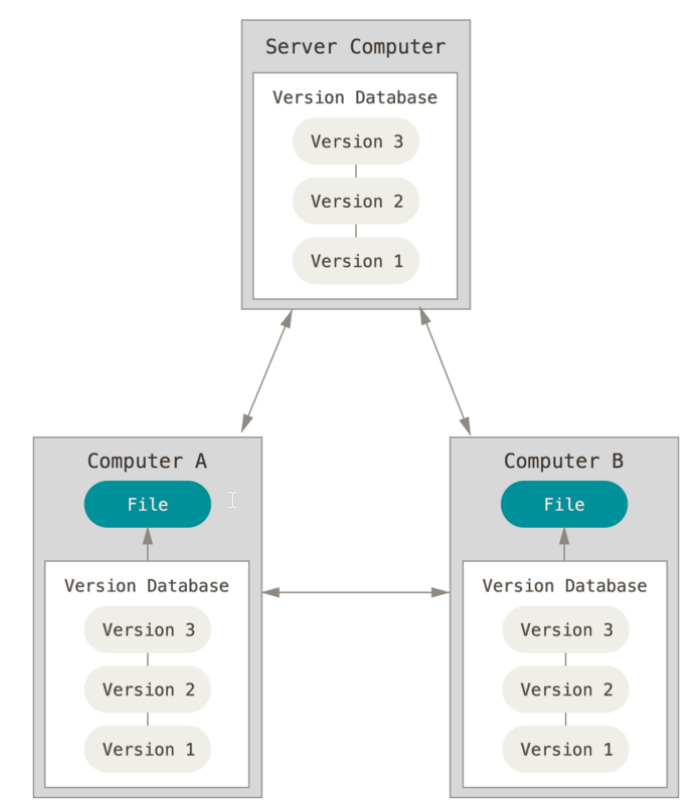
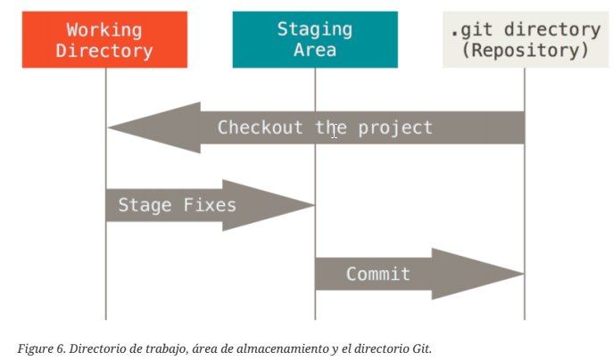
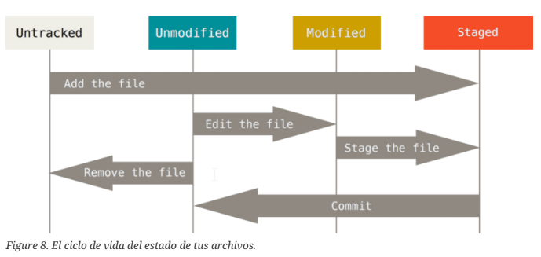

<div align="center">
  <h1>Curso Profesional de Git y GitHlab o Github</h1>
</div>

<div align="center">
  
</div>

# Tabla de contenido
- [Inicio - Sobre el Control de Versiones](#Inicio-Sobre-el-Control-de-Versiones)
	- [Acerca del Control de Versiones](#Acerca-del-Control-de-Versiones)
	- [Sistemas de Control de Versiones Locales](#Sistemas-de-Control-de-Versiones-Locales)
	- [Sistemas de Control de Versiones Centralizados](#Sistemas-de-Control-de-Versiones-Centralizados)
	- [Sistemas de Control de Versiones Distribuidos](#Sistemas-de-Control-de-Versiones-Distribuidos)
	- [Una breve historia de Git](#Una-breve-historia-de-Git)
	- [Los Tres Estados](#Los-Tres-Estados)
  - [Instalación de Git](#Instalación-de-Git)
  - [Configurando Git por primera vez](#Configurando-Git-por-primera-vez)
  - [¿Cómo obtener ayuda?](#¿Cómo-obtener-ayuda?)
- [Obteniendo un repositorio Git](#Obteniendo-un-repositorio-Git)
  - [Guardando cambios en el Repositorio](#Guardando-cambios-en-el-Repositorio)


# <a name="Inicio-Sobre-el-Control-de-Versiones">Inicio - Sobre el Control de Versiones</a>

## <a name="Acerca-del-Control-de-Versiones">Acerca del Control de Versiones</a>

**¿Qué es un control de versiones, y por qué debería importarte?**

<div align="center">
  <p>
Un control de versiones es un
sistema que registra los cambios realizados en un archivo o conjunto de archivos a lo largo del
tiempo, de modo que puedas recuperar versiones específicas más adelante. Aunque en los ejemplos
de este libro usarás archivos de código fuente como aquellos cuya versión está siendo controlada,
en realidad puedes hacer lo mismo con casi cualquier tipo de archivo que encuentres en una
computadora.

Si eres diseñador gráfico o de web y quieres mantener cada versión de una imagen o diseño (es
algo que sin duda vas a querer), usar un sistema de control de versiones (VCS por sus siglas en
inglés) es una decisión muy acertada. Dicho sistema te permite regresar a versiones anteriores de
tus archivos, regresar a una versión anterior del proyecto completo, comparar cambios a lo largo
del tiempo, ver quién modificó por última vez algo que pueda estar causando problemas, ver quién
introdujo un problema y cuándo, y mucho más. Usar un VCS también significa generalmente que si
arruinas o pierdes archivos, será posible recuperarlos fácilmente. Adicionalmente, obtendrás todos
estos beneficios a un costo muy bajo.
  </p>
</div>


## <a name="Sistemas-de-Control-de-Versiones-Locales">Sistemas de Control de Versiones Locales</a>

<div align="center">
  <p>
Un método de control de versiones, usado por muchas personas, es copiar los archivos a otro
directorio (quizás indicando la fecha y hora en que lo hicieron, si son ingeniosos). Este método es
muy común porque es muy sencillo, pero también es tremendamente propenso a errores. Es fácil
olvidar en qué directorio te encuentras y guardar accidentalmente en el archivo equivocado o
sobrescribir archivos que no querías.
Para afrontar este problema los programadores desarrollaron hace tiempo VCS locales que
contenían una simple base de datos, en la que se llevaba el registro de todos los cambios realizados
a los archivos.
  </p>
</div>

<div align="center">
  
</div>

<div align="center">
  <p>
Una de las herramientas de control de versiones más popular fue un sistema llamado RCS, que
todavía podemos encontrar en muchas de las computadoras actuales. Incluso el famoso sistema
operativo Mac OS X incluye el comando rcs cuando instalas las herramientas de desarrollo. Esta
herramienta funciona guardando conjuntos de parches (es decir, las diferencias entre archivos) en
un formato especial en disco, y es capaz de recrear cómo era un archivo en cualquier momento a
partir de dichos parches.
  </p>
</div>


## <a name="Sistemas-de-Control-de-Versiones-Centralizados">Sistemas de Control de Versiones Centralizados</a>


<div align="center">
  <p>
El siguiente gran problema con el que se encuentran las personas es que necesitan colaborar con
desarrolladores en otros sistemas. Los sistemas de Control de Versiones Centralizados (CVCS por sus
siglas en inglés) fueron desarrollados para solucionar este problema. Estos sistemas, como CVS,
Subversion y Perforce, tienen un único servidor que contiene todos los archivos versionados y
varios clientes que descargan los archivos desde ese lugar central. Este ha sido el estándar para el
control de versiones por muchos años.
  </p>
</div>


<div align="center">
  
</div>

<div align="center">
  <p>
Esta configuración ofrece muchas ventajas, especialmente frente a VCS locales. Por ejemplo, todas
las personas saben hasta cierto punto en qué están trabajando los otros colaboradores del proyecto.
Los administradores tienen control detallado sobre qué puede hacer cada usuario, y es mucho más
fácil administrar un CVCS que tener que lidiar con bases de datos locales en cada cliente.
Sin embargo, esta configuración también tiene serias desventajas. La más obvia es el punto único
de fallo que representa el servidor centralizado. Si ese servidor se cae durante una hora, entonces
durante esa hora nadie podrá colaborar o guardar cambios en archivos en los que hayan estado
trabajando. Si el disco duro en el que se encuentra la base de datos central se corrompe, y no se han
realizado copias de seguridad adecuadamente, se perderá toda la información del proyecto, con
excepción de las copias instantáneas que las personas tengan en sus máquinas locales. Los VCS
locales sufren de este mismo problema: Cuando tienes toda la historia del proyecto en un mismo
lugar, te arriesgas a perderlo todo.
  </p>
</div>


## <a name="Sistemas-de-Control-de-Versiones-Distribuidos">Sistemas de Control de Versiones Distribuidos</a>


<div align="center">
  <p>
Los sistemas de Control de Versiones Distribuidos (DVCS por sus siglas en inglés) ofrecen soluciones
para los problemas que han sido mencionados. En un DVCS (como Git, Mercurial, Bazaar o Darcs),
los clientes no solo descargan la última copia instantánea de los archivos, sino que se replica
completamente el repositorio. De esta manera, si un servidor deja de funcionar y estos sistemas
estaban colaborando a través de él, cualquiera de los repositorios disponibles en los clientes puede
ser copiado al servidor con el fin de restaurarlo. Cada clon es realmente una copia completa de
todos los datos.
  </p>
</div>


<div align="center">
  
</div>

<div align="center">
  <p>
Además, muchos de estos sistemas se encargan de manejar numerosos repositorios remotos con los
cuales pueden trabajar, de tal forma que puedes colaborar simultáneamente con diferentes grupos
de personas en distintas maneras dentro del mismo proyecto. Esto permite establecer varios flujos
de trabajo que no son posibles en sistemas centralizados, como pueden ser los modelos jerárquicos.
  </p>
</div>


## <a name="Una-breve-historia-de-Git">Una breve historia de Git</a>


<div align="center">
  <p>
Como muchas de las grandes cosas en esta vida, Git comenzó con un poco de destrucción creativa y
una gran polémica.

El kernel de Linux es un proyecto de software de código abierto con un alcance bastante amplio.
Durante la mayor parte del mantenimiento del kernel de Linux (1991-2002), los cambios en el
software se realizaban a través de parches y archivos. En el 2002, el proyecto del kernel de Linux
empezó a usar un DVCS propietario llamado BitKeeper.

En el 2005, la relación entre la comunidad que desarrollaba el kernel de Linux y la compañía que
desarrollaba BitKeeper se vino abajo y la herramienta dejó de ser ofrecida de manera gratuita. Esto
impulsó a la comunidad de desarrollo de Linux (y en particular a Linus Torvalds, el creador de
Linux) a desarrollar su propia herramienta basada en algunas de las lecciones que aprendieron
mientras usaban BitKeeper. Algunos de los objetivos del nuevo sistema fueron los siguientes:
  </p>
</div>

• Velocidad

• Diseño sencillo

• Gran soporte para desarrollo no lineal (miles de ramas paralelas)

• Completamente distribuido

• Capaz de manejar grandes proyectos (como el kernel de Linux) eficientemente (velocidad y tamaño de los datos)


<div align="center">
  <p>
Desde su nacimiento en el 2005, Git ha evolucionado y madurado para ser fácil de usar y conservar
sus características iniciales. Es tremendamente rápido, muy eficiente con grandes proyectos y tiene
un increíble sistema de ramificación (branching) para desarrollo no lineal
  </p>
</div>


## <a name="Los-Tres-Estados">Los Tres Estados</a>

**Git tiene tres estados principales en los que se pueden encontrar tus archivos:**

- modificado (modified)
- preparado (staged)
- confirmado (committed)


- Modificado: significa que has modificado el archivo pero todavía no lo has confirmado a tu base de datos.
- Preparado: significa que has marcado un archivo modificado en su versión actual para que vaya en tu próxima confirmación.
- Confirmado: significa que los datos están almacenados de manera segura en tu base de datos local.

**Esto nos lleva a las tres secciones principales de un proyecto de Git:**

- El directorio de trabajo (working directory)
- El área de preparación (staging area)
- El directorio de Git (Git directory)


<div align="center">
  
</div>


> El directorio de trabajo es una copia de una versión del proyecto. Estos archivos se sacan de la base
de datos comprimida en el directorio de Git, y se colocan en disco para que los puedas usar o
modificar.

> El área de preparación es un archivo, generalmente contenido en tu directorio de Git, que almacena
información acerca de lo que va a ir en tu próxima confirmación. A veces se le denomina índice
(“index”), pero se está convirtiendo en estándar el referirse a ella como el área de preparación.

> El directorio de Git es donde se almacenan los metadatos y la base de datos de objetos para tu
proyecto. Es la parte más importante de Git, y es lo que se copia cuando clonas un repositorio desde
otra computadora.

**El flujo de trabajo básico en Git es algo así:**

- Modificas una serie de archivos en tu directorio de trabajo.
- Preparas los archivos, añadiéndolos a tu área de preparación.
- Confirmas los cambios, lo que toma los archivos tal y como están en el área de preparación y almacena esa copia instantánea de manera permanente en tu directorio de Git.


<div align="center">
  <p>
Si una versión concreta de un archivo está en el directorio de Git, se considera confirmada
(committed). Si ha sufrido cambios desde que se obtuvo del repositorio, pero ha sido añadida al
área de preparación, está preparada (staged). Y si ha sufrido cambios desde que se obtuvo del
repositorio, pero no se ha preparado, está modificada (modified).
  </p>
</div>


## <a name="Instalación-de-Git">Instalación de Git</a>

**Instalación en Linux**

Si quieres instalar Git en Linux a través de un instalador binario, en general puedes hacerlo
mediante la herramienta básica de administración de paquetes que trae tu distribución. Si estás en Fedora por ejemplo, puedes usar yum:


```sh
yum install git
```
Si estás en una distribución basada en Debian como Ubuntu, puedes usar apt-get:

```sh
apt-get install git
```


## <a name="Configurando-Git-por-primera-vez">Configurando Git por primera vez</a>

<div align="center">
  <p>
Ahora que tienes Git en tu sistema, vas a querer hacer algunas cosas para personalizar tu entorno
de Git. Es necesario hacer estas cosas solamente una vez en tu computadora, y se mantendrán entre
actualizaciones. También puedes cambiarlas en cualquier momento volviendo a ejecutar los
comandos correspondientes.
  </p>
</div>

<div align="center">
  <p>
Git trae una herramienta llamada git config, que te permite obtener y establecer variables de
configuración que controlan el aspecto y funcionamiento de Git. Estas variables pueden
almacenarse en tres sitios distintos:
  </p>
</div>


1. Archivo /etc/gitconfig: Contiene valores para todos los usuarios del sistema y todos sus
repositorios. Si pasas la opción --system a git config, lee y escribe específicamente en este
archivo.

2. Archivo ~/.gitconfig o ~/.config/git/config: Este archivo es específico de tu usuario. Puedes
hacer que Git lea y escriba específicamente en este archivo pasando la opción --global.

3. Archivo config en el directorio de Git (es decir, .git/config) del repositorio que estés utilizando
actualmente: Este archivo es específico del repositorio actual.


<div align="center">
  <p>
Cada nivel sobrescribe los valores del nivel anterior, por lo que los valores de .git/config tienen
preferencia sobre los de /etc/gitconfig.

En sistemas Windows, Git busca el archivo .gitconfig en el directorio $HOME (para mucha gente será
(C:\Users\$USER). También busca el archivo /etc/gitconfig, aunque esta ruta es relativa a la raíz
MSys, que es donde decidiste instalar Git en tu sistema Windows cuando ejecutaste el instalador.
  </p>
</div>


**Tu Identidad**


<div align="center">
  <p>
Lo primero que deberás hacer cuando instales Git es establecer tu nombre de usuario y dirección
de correo electrónico. Esto es importante porque los "commits" de Git usan esta información, y es
introducida de manera inmutable en los commits que envías:
  </p>
</div>

```sh
git config --global user.name "nombre De Usuario"
# Ejemplo
git config --global user.name "wiiiccho"

git config --global user.email correo@ejemplo.com
# Ejemplo
git config --global user.email wiiiccho@gmail.com
```

<div align="center">
  <p>
De nuevo, sólo necesitas hacer esto una vez si especificas la opción --global, ya que Git siempre
usará esta información para todo lo que hagas en ese sistema. Si quieres sobrescribir esta
información con otro nombre o dirección de correo para proyectos específicos, puedes ejecutar el
comando sin la opción --global cuando estés en ese proyecto.
  </p>
</div>


**Tu Editor**


<div align="center">
  <p>
Ahora que tu identidad está configurada, puedes elegir el editor de texto por defecto que se
utilizará cuando Git necesite que introduzcas un mensaje. Si no indicas nada, Git usará el editor por
defecto de tu sistema, que generalmente es Vim. Si quieres usar otro editor de texto como Emacs,
puedes hacer lo siguiente:
  </p>
</div>


```sh
git config --global core.editor emacs
```

**Comprobando tu Configuración**

Si quieres comprobar tu configuración, puedes usar el siguiente comando para mostrar todas las propiedades que Git ha configurado:

```sh
git config --list
```

Y te saldra esto

```sh
git config --list

user.name=wiiiccho
user.email=wiiiccho@gmail.com
color.status=auto
color.branch=auto
color.interactive=auto
color.diff=auto
```


También puedes comprobar el valor que Git utilizará para una clave específica ejecutando

```sh
git config <key>
```

```sh
git config user.name
wiiiccho
```

## <a name="¿Cómo-obtener-ayuda?">¿Cómo obtener ayuda?</a>

Si alguna vez necesitas ayuda usando Git, existen tres formas de ver la página del manual
(manpage) para cualquier comando de Git:

```sh
git help <verb>
git <verb> --help
man git-<verb>
```
Por ejemplo, puedes ver la página del manual para el comando config ejecutando

```sh
git help config
```


# <a name="Obteniendo-un-repositorio-Git">Obteniendo un repositorio Git</a>

**Inicializando un repositorio en un directorio existente**

Si estás empezando a seguir un proyecto existente en Git, debes ir al directorio del proyecto y usar
el siguiente comando:


```sh
git init
```
Esto crea un subdirectorio nuevo llamado .git, el cual contiene todos los archivos necesarios del
repositorio – un esqueleto de un repositorio de Git. Todavía no hay nada en tu proyecto que esté
bajo seguimiento.


Si deseas empezar a controlar versiones de archivos existentes (a diferencia de un directorio vacío),
probablemente deberías comenzar el seguimiento de esos archivos y hacer una confirmación
inicial. Puedes conseguirlo con unos pocos comandos para especificar qué archivos quieres
controlar:

```sh
git add nombreDelArchivo
```

Segundo comando  para confirmar los cambios:
Existen dos formas de hacerlo
```sh
# 1
git commit
# 2
git commit -m "versión inicial del proyecto"
```

**Clonando un repositorio existente**

Si deseas obtener una copia de un repositorio Git existente — por ejemplo, un proyecto en el que te
gustaría contribuir — el comando que necesitas es

```sh
git clone [url]
```
Ejemplo:

```sh
git clone https://github.com/libgit2/libgit2
```

Esto crea un directorio llamado libgit2, inicializa un directorio .git en su interior, descarga toda la
información de ese repositorio y saca una copia de trabajo de la última versión. Si te metes en el
directorio libgit2, verás que están los archivos del proyecto listos para ser utilizados. Si quieres
clonar el repositorio a un directorio con otro nombre que no sea libgit2, puedes especificarlo con
la siguiente opción de línea de comandos:

Ese comando hace lo mismo que el anterior, pero el directorio de destino se llamará nuevoNombreDeArchivo.
```sh
git clone https://github.com/libgit2/libgit2 nuevoNombreDeArchivo
```

Git te permite usar distintos protocolos de transferencia. El ejemplo anterior usa el protocolo
https://, pero también puedes utilizar git:// o usuario@servidor:ruta/del/repositorio.git que
utiliza el protocolo de transferencia SSH.


## <a name="Guardando-cambios-en-el-Repositorio">Guardando cambios en el Repositorio</a>


El siguiente paso es realizar algunos cambios y confirmar instantáneas de esos cambios en el
repositorio cada vez que el proyecto alcance un estado que quieras conservar.


## Recuerda que cada archivo de tu repositorio puede tener dos estados:

### 1 sin rastrear 

**Untracked**

Los archivos sin rastrear son todos los demás - cualquier otro archivo en tu directorio de trabajo que no
estaba en tu última instantánea y que no está en el área de preparación (staging area).


### 2 rastreados

Los archivos rastreados (tracked files en inglés) son todos aquellos archivos que estaban en la última
instantánea del proyecto.

**Unmodified**

Pueden ser archivos sin modificar

**Modified**

Pueden ser archivos modificados

**Staged**

Pueden ser archivos preparados


**Notas**

> Cuando clonas por primera vez un repositorio, todos tus archivos estarán rastreados y sin modificar pues
acabas de sacarlos y aun no han sido editados.

> Mientras editas archivos, Git los ve como modificados, pues han sido cambiados desde su último
commit. 

> Luego preparas estos archivos modificados.

> finalmente confirmas todos los cambios preparados, y repites el ciclo.


<div align="center">
  
</div>


## Revisando el Estado de tus Archivos

La herramienta principal para determinar qué archivos están en qué estado es el comando. Si ejecutas este comando inmediatamente después de clonar un repositorio.


```sh
git status
```

Deberías ver algo como esto:

```sh
git status

On branch master
nothing to commit, working directory clean
```

Esto significa que tienes un directorio de trabajo limpio - en otras palabras, que no hay archivos
rastreados y modificados. Además, Git no encuentra archivos sin rastrear, de lo contrario
aparecerían listados aquí. Finalmente, el comando te indica en cuál rama estás.

**Ejemplo trabajando con Untracked**


Supongamos que añades un nuevo archivo a tu proyecto, un simple README. 

```sh
echo 'My Project' > README
```
Si el archivo no existía antes y ejecutas el siguiente comando:

```sh
git status
```
Verás el archivo sin rastrear de la siguiente manera:

```sh
git status

On branch master
Untracked files:
  (use "git add <file>..." to include in what will be committed)
    README
nothing added to commit but untracked files present (use "git add" to track)
```
Puedes ver que el archivo README está sin rastrear porque aparece debajo del encabezado
“Untracked files” (“Archivos no rastreados” en inglés) en la salida.


**Rastrear Archivos Nuevos**


Para comenzar a rastrear un archivo debes usar el comando.

```sh
git add
```
Para comenzar a rastrear el archivo README, puedes ejecutar lo siguiente:

```sh
git add README
```

Ahora si vuelves a ver el estado del proyecto, verás que el archivo README está siendo rastreado y
está preparado para ser confirmado:

```sh
git status

On branch master
  Changes to be committed:
    (use "git reset HEAD <file>..." to unstage)
      new file: README
```
Puedes ver que está siendo rastreado porque aparece luego del encabezado “Cambios a ser
confirmados” (“Changes to be committed” en inglés).


**Preparar Archivos Modificados**

Vamos a editar un archivo que esté rastreado. En este caso si editamos el archivo README y luego ejecutas el comando

```sh
git status
```
Verás algo parecido a esto:

```sh
git status
On branch master

No commits yet

Changes to be committed:
  (use "git rm --cached <file>..." to unstage)
        new file:   README

Changes not staged for commit:
  (use "git add <file>..." to update what will be committed)
  (use "git restore <file>..." to discard changes in working directory)
        modified:   README
```
“Changes not staged for commit”
(“Cambios no preparado para confirmar” en inglés) - lo que significa que existe un archivo
rastreado que ha sido modificado en el directorio de trabajo pero que aún no está preparado. Para
prepararlo, ejecutas el comando.


```sh
git add README
```
Luego ejecutemos y veremos algo asi

```sh
git status

On branch master

No commits yet

Changes to be committed:
  (use "git rm --cached <file>..." to unstage)
        new file:   README
```

git add es un comando que cumple varios propósitos - lo usas para empezar a rastrear archivos nuevos, preparar archivos,


## Estado Abreviado

Si bien es cierto que la salida de git status es bastante explícita, también es verdad que es muy
extensa. Git ofrece una opción para obtener un estado abreviado, de manera que puedas ver tus
cambios de una forma más compacta. Si ejecutas

```sh
git status -s
git status --short
```

Obtendrás una salida mucho más simplificada.

**El estado aparece en dos columnas:** 

- La columna de la izquierda indica el estado preparado.
- La columna de la derecha indica el estado sin preparar.

**Descripcion de las apreviaturas**

- Los archivos nuevos que no están rastreados tienen un ?? a su lado
- Los archivos que están preparados tienen una A
- Los modificados una M.

```sh
git status -s
M README
MM Rakefile
A lib/git.rb
M lib/simplegit.rb
?? LICENSE.txt
```
Por ejemplo, en esa salida, el archivo README está modificado en el directorio de trabajo pero no está
preparado, mientras que lib/simplegit.rb está modificado y preparado. El archivo Rakefile fue
modificado, preparado y modificado otra vez por lo que existen cambios preparados y sin preparar.


## Ver los Cambios Preparados y No Preparados


¿Qué has
cambiado pero aun no has preparado? y ¿Qué has preparado y está listo para confirmar? A pesar
de que git status responde a estas preguntas de forma muy general listando el nombre de los
archivos.

Este comando compara lo que tienes en tu directorio de trabajo con lo que está en el área de
preparación. El resultado te indica los cambios que has hecho pero que aun no has preparado.

```sh
git diff
```

**Git Diff como Herramienta Externa**

A lo largo del libro, continuaremos usando el comando git diff de distintas
maneras. Existe otra forma de ver estas diferencias si prefieres utilizar una interfaz
gráfica u otro programa externo. Si ejecutas.


```sh
# Los dos son validos
git difftool
git difftool --tool=vimdiff3
```


## Confirmar tus Cambios

Ahora que tu área de preparación está como quieres, puedes confirmar tus cambios. Recuerda que
cualquier cosa que no esté preparada - cualquier archivo que hayas creado o modificado y que no
hayas agregado con git add desde su edición - no será confirmado. Se mantendrán como archivos
modificados en tu disco. En este caso, digamos que la última vez que ejecutaste git status
verificaste que todo estaba preparado y que estás listo para confirmar tus cambios. La forma más
sencilla de confirmar es escribiendo


```sh
git commit
```
Al hacerlo, arrancará el editor de tu preferencia. (El editor se establece a través de la variable de
ambiente $EDITOR de tu terminal - usualmente es vim o emacs.

Otra alternativa es escribir el mensaje de confirmación directamente en el comando commit
utilizando la opción -m:

```sh
git commit -m "Mi primer comentario"
```


## Eliminar Archivos

Si simplemente eliminas el archivo de tu directorio de trabajo, aparecerá en la sección “Changes
not staged for commit” (esto es, sin preparar) en la salida de git status:


```sh
rm PROJECTS.md
```

```sh
git status

On branch master
Your branch is up-to-date with 'origin/master'.
Changes not staged for commit:
  (use "git add/rm <file>..." to update what will be committed)
  (use "git checkout -- <file>..." to discard changes in working directory)
      deleted: PROJECTS.md
no changes added to commit (use "git add" and/or "git commit -a")
```

Para eliminar archivos de Git, debes eliminarlos de tus archivos rastreados (o mejor dicho,
eliminarlos del área de preparación) y luego confirmar. Para ello existe el comando git rm, que
además elimina el archivo de tu directorio de trabajo de manera que no aparezca la próxima vez
como un archivo no rastreado.

Entonces se prepara la eliminación del archivo:

Con la próxima confirmación, el archivo habrá desaparecido y no volverá a ser rastreado.

```sh
git rm PROJECTS.md
```

```sh
git status
On branch master
Changes to be committed:
(use "git reset HEAD <file>..." to unstage)
deleted: PROJECTS.md
```

Otra cosa que puedas querer hacer es mantener el archivo en tu directorio de trabajo pero
eliminarlo del área de preparación. En otras palabras, quisieras mantener el archivo en tu disco
duro pero sin que Git lo siga rastreando. Esto puede ser particularmente útil si olvidaste añadir algo
en tu archivo .gitignore y lo preparaste accidentalmente, algo como un gran archivo de trazas a un
montón de archivos compilados .a. Para hacerlo, utiliza la opción --cached:

```sh
git rm --cached PROJECTS.md
```
Otra cosa que puedas querer hacer es elimina los archivos de Git y del disco duro. Git guarda el registro de la existencia de los archivos, por lo que podremos recuperarlos si es necesario (pero debemos usar comandos más avanzados)

```sh
git rm --force PROJECTS.md
```


<div align="center">
  
</div>


- [urlurlrl](httpshttpshttps)

<div align="center">
  <p>

  </p>
</div>


- [Introducción](#Introducción)

# <a name="Introducción">Introducción</a>

```sh
$ sudo yum install python
```
